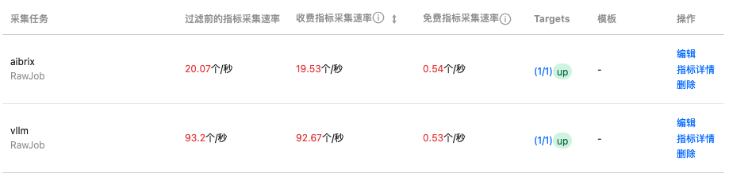

# 满血版 DeepSeek R1 部署

> TODO：暂时没有支持 RDMA

> 可以参考文档：https://github.com/vllm-project/aibrix/tree/main/samples/deepseek-r1

## 部署工作负载

首先配置 AIBrix 基础环境：

```console
$ kubectl apply -f deepseek-r1-ai-runtime.yaml
$ kubectl apply -f deepseek-r1-autoscaling.yaml
```

以 playbook 项目根目录为工作目录，假设创建的 PVC 的名字为 `ai-model`，可以通过如下命令在 2*8 H20 的集群上创建分布式推理的工作负载和 service：

```console
$ helm install deepseek-r1 ./aibrix --set shortModelName=deepseek-r1 --set modelName=deepseek-ai/DeepSeek-R1 --set pvcName=ai-model --set parallelArgs="--tensor-parallel-size 8 --pipeline-parallel-size 2"
```

之后可以通过 `kubectl get svc` 查看部署好的 service，它的暴露了两个端口：

- http(8080)：通过 `/metrics` 暴露 vLLM 指标
- serve(8000)：可以使用其访问 openAI API，也可以通过 `/metrics` 暴露 AIBrix 指标

可以使用 curl 测试：

```console
$ curl http://<CLUSTER_IP>:8000/v1/chat/completions \
	-H "Content-Type: application/json" -H "routing-strategy: least-request" \
	-d '{
        	"model": "deepseek-ai/DeepSeek-R1",
        	"messages": [
            		{"role": "system", "content": "You are a helpful assistant."},
            		{"role": "user", "content": "你是谁？"}
        	]
	}' | jq .
{
  "id": "chatcmpl-a84e680476e24e50a4bcd4195b20a5ae",
  "object": "chat.completion",
  "created": 1743412839,
  "model": "deepseek-ai/DeepSeek-R1",
  "choices": [
    {
      "index": 0,
      "message": {
        "role": "assistant",
        "reasoning_content": null,
        "content": "您好！我是由中国的深度求索（DeepSeek）公司开发的智能助手DeepSeek-R1。如您有任何任何问题，我会尽我所能为您提供帮助。\n</think>\n\n您好！我是由中国的深度求索（DeepSeek）公司开发的智能助手DeepSeek-R1。如您有任何任何问题，我会尽我所能为您提供帮助。",
        "tool_calls": []
      },
      "logprobs": null,
      "finish_reason": "stop",
      "stop_reason": null
    }
  ],
  "usage": {
    "prompt_tokens": 13,
    "total_tokens": 90,
    "completion_tokens": 77,
    "prompt_tokens_details": null
  },
  "prompt_logprobs": null
}
```

## 配置监控

在控制台上根据 deepseek-r1-service 的 `serve` 和 `http` 端口配置监控：



vLLM 的监控：


AIBrix 的监控（对比 vLLm 有更多的细节，例如 prefix cache 和 KV cache utility）：


